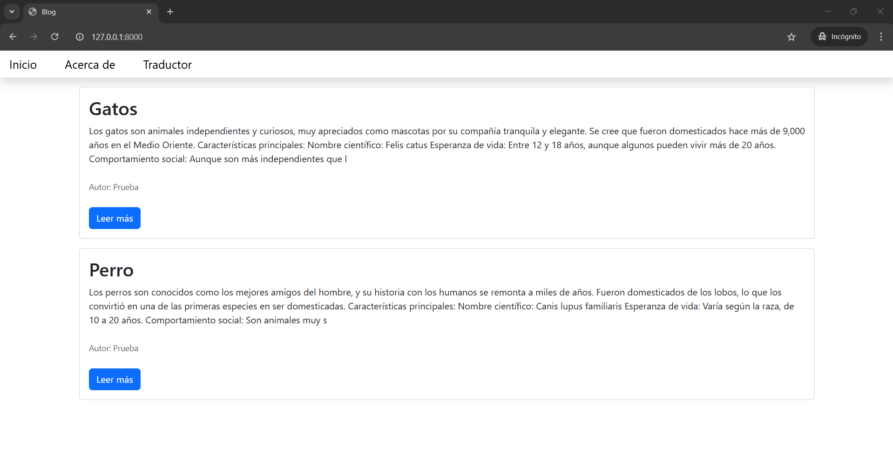
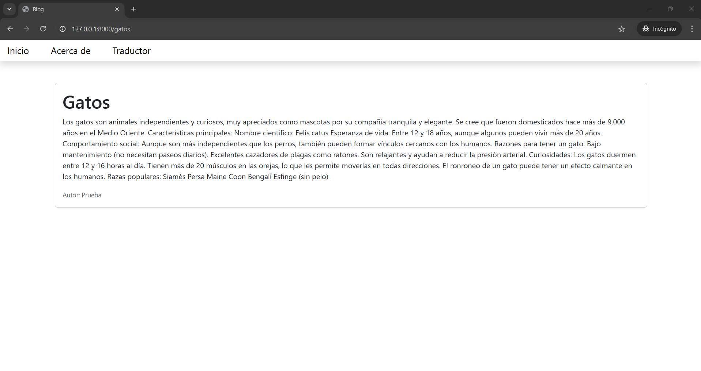
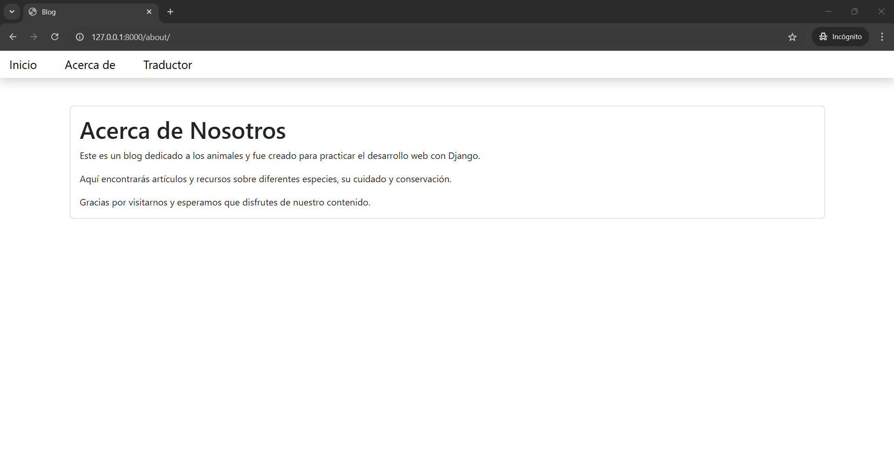
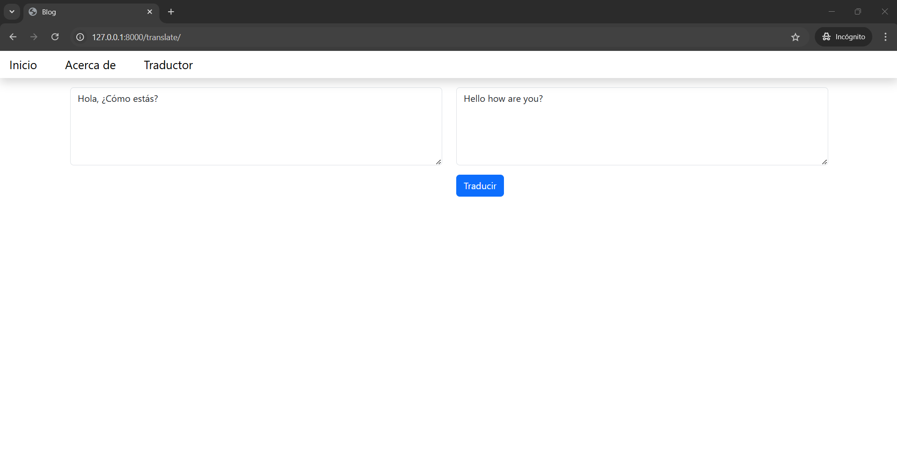

# **Django Blog & Translator App**

### **Descripción**  
Este proyecto fue desarrollado como parte del curso *The Python Mega Course: Build 10 Real World Applications* en Udemy. Incluye dos aplicaciones principales realizadas con Django, diseñadas para practicar conceptos fundamentales de desarrollo web y el uso del framework Django.  

1. **Blog:** Una plataforma básica para gestionar publicaciones.  
2. **App de Traducción:** Una herramienta para traducir texto entre diferentes idiomas.  

### **Características**  

#### **Blog:**  
- CRUD (Crear, Leer, Actualizar y Eliminar) de publicaciones.  
- Interfaz responsiva utilizando plantillas Bootstrap.  
- Organización de contenido en páginas individuales para cada publicación.  

#### **App de Traducción:**  
- Traducción de texto utilizando la biblioteca `googletrans`.  
- Interfaz intuitiva con formularios para introducir y mostrar traducciones.  
- Uso de plantillas HTML para la visualización.  

### **Requisitos Previos**  
- Python 3.8 o superior.  
- Django 4.2 o superior.  
- Paquetes adicionales especificados en `requirements.txt` (si existe).  

### **Instalación y Configuración**  

1. **Clonar este repositorio:**  

2. **Configurar un entorno virtual:**  
   ```bash
   python -m venv env
   source env/bin/activate  # En Windows: env\Scripts\activate
   ```

3. **Instalar dependencias:**  
   ```bash
   pip install -r requirements.txt
   ```

4. **Aplicar las migraciones:**  
   ```bash
   python manage.py makemigrations
   python manage.py migrate
   ```

5. **Ejecutar el servidor de desarrollo:**  
   ```bash
   python manage.py runserver
   ```

6. **Acceder a las aplicaciones en el navegador:**  
   - Blog: `http://127.0.0.1:8000`  
   - Traducción: `http://127.0.0.1:8000/translate/`  

### **Estructura del Proyecto**  

- **Base de datos:** `db.sqlite3`  
- **Aplicaciones:**  
  - `blog/`: Contiene la lógica del blog, modelos, vistas y URLs.  
  - `translator/`: Contiene la funcionalidad para la traducción.  
- **Plantillas:**  
  - `templates/about.html`: Página "Acerca de".  
  - `templates/base.html`: Plantilla base utilizada por todas las páginas.  
  - `templates/blog.html`: Contenido de una publicación individual.
  - `templates/index.html`: Listado de publicaciones.
  - `templates/translator.html`: Interfaz para la traducción.  

### **Capturas de Pantalla**  

1. Pagína de inicio:
    
2. Una publicación:
    
3. Acerca de:
    
4. Página de traducción:
    
5. Ejemplo de traducción
    

### **Propósito del Proyecto**  
Este proyecto fue realizado como práctica para mejorar habilidades en:  
- Uso del framework Django.  
- Creación de aplicaciones modulares y reutilizables.  
- Trabajo con plantillas y diseño responsivo.  
